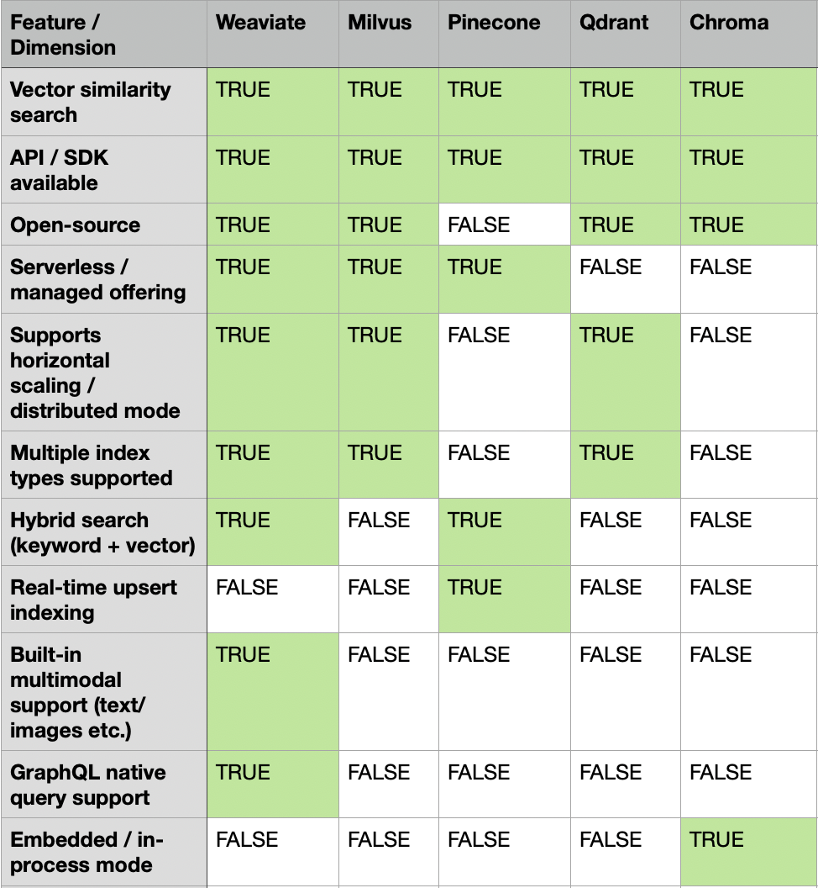

# Vector databases

# Comparative analysis

##### Weaviate, Milvus, Pinecone, Qdrant, and Chroma

### Conclusions

1. **In production settings, use Weviate by default**, as it is the most fully-featured solution by a significant margin.
	1. **Weaviate** is the most complete solution _**and**_
    2. it is **open-source**.
	3. It only **lacks**
	   1. _(desirable)_ **real-time upsert indexing**, which in turn is only implemented by Pinecone, which is not open-source. Hence, real-time upsert indexing must be seen as a proprietary, vendor-specific competitive advantage. On top of that, while being able to upsert records is definitely a requirement, the range of use cases requiring to do so in real-time seems highly constrained;
	   2. _(hard to get)_ **in-process mode**, which is exclusively to Chroma, the most lightweight vector database.
	3. It also features both **hybrid neuralized and lexical search**, which sets it apart from all other vector databases and next to Pinecone, again the closed-source, proprietary solution.
	4. Last, **native multimodal support** crucially distinguishes it from Pinecone, even.
2. For **quick prototyping, Chroma is a strong, legitimate alternative**.

### Summary

[Source data](vector_databases.csv)

